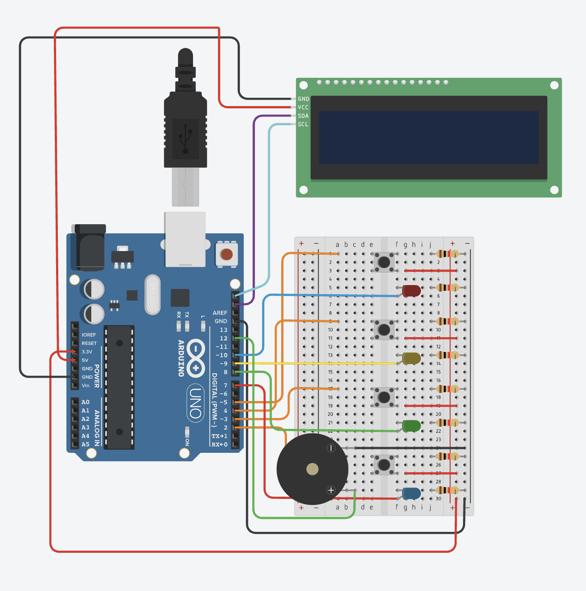
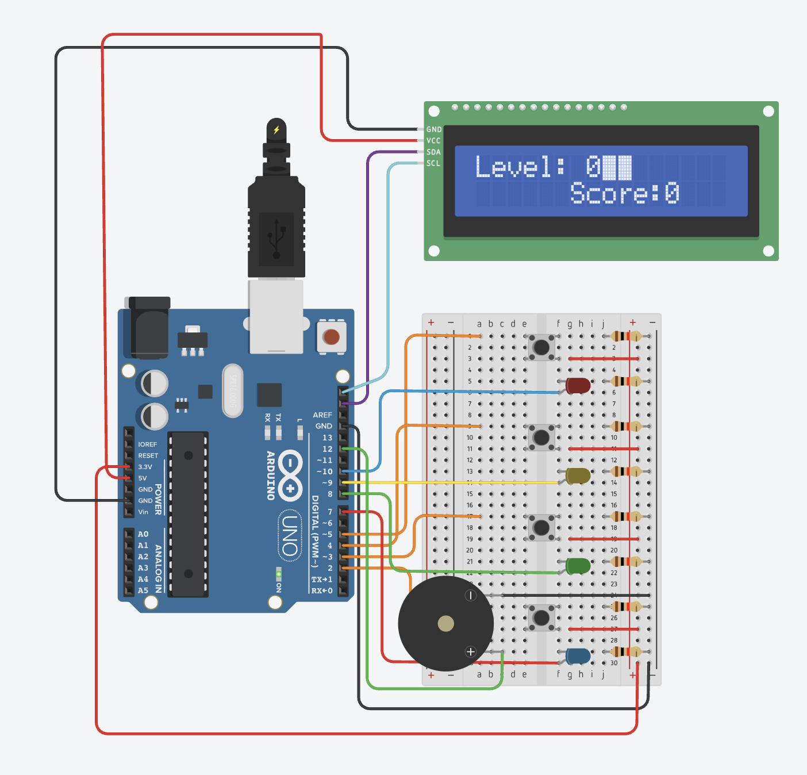
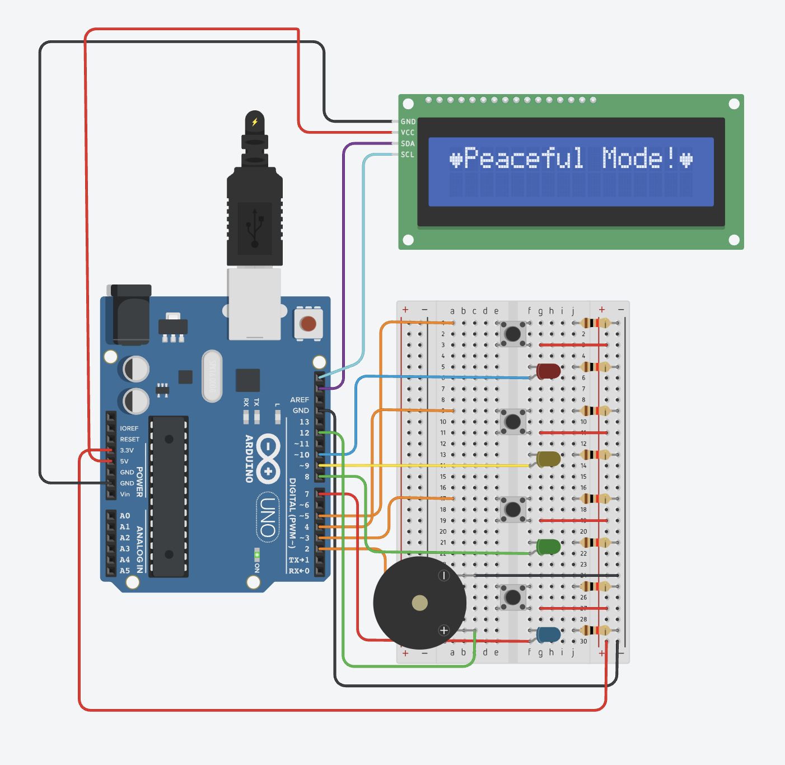
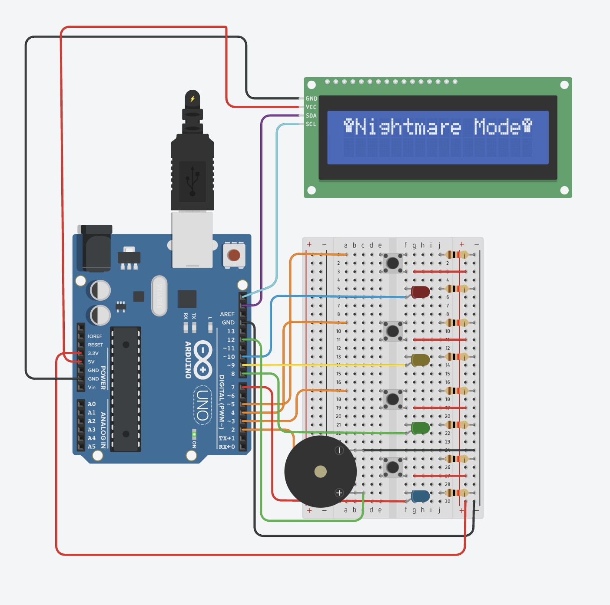

# 🎮 Arduino Memory Game
An Arduino-based memory game built and simulated in Tinkercad using C++. The game uses LEDs, push buttons, a buzzer, and an LCD display to create an interactive memory challenge. 
It includes two difficulty modes, a scoring system, and randomly generated light sequences. This project helped me practice Arduino programming, circuit design, and working with hardware inputs and outputs.
## 🛠️ Technologies
- Arduino Uno
- C++
- Tinkercad Circuits
- 16x2 I2C LCD
- LEDs and Push Buttons
- Piezo Buzzer

## ✨ Features
- Two difficulty modes: Peaceful Mode and Nightmare Mode
- Randomly generated LED sequences
- Four-button player input
- Score and level tracking
- LCD display for game information
- Sound feedback using a buzzer
- High-score display and reset option

## 🔌 Circuit Design
The circuit was designed and simulated using Tinkercad Circuits. It connects an Arduino Uno with four LEDs, four push buttons, an I2C LCD display, and a buzzer to create the memory game.

## 🎥 Demo
A short demonstration of the physical Arduino Memory Game in action.
[▶️ Watch the Game Demo](https://github.com/user-attachments/assets/f437232f-3cb1-4795-9b20-be5271aeef8a)

## ⚙️ How It Works
1. The player selects either Peaceful Mode or Nightmare Mode.
2. The Arduino generates a random sequence of LED lights.
3. The LEDs flash in sequence with sound feedback from the buzzer.
4. The player repeats the sequence using the corresponding push buttons.
5. The program checks the player's input against the generated sequence.
6. If the sequence is correct, the score increases and the player continues to the next level.
7. If the sequence is incorrect, the game ends and the score is recorded.

## 🎮 Game Modes

### Peaceful Mode
Peaceful Mode is the standard difficulty. The player follows the generated LED sequence, and the sequence becomes longer as the player progresses through the levels.

### Nightmare Mode
Nightmare Mode is the more challenging difficulty. The game increases the player's progress less predictably, making the sequence harder to follow.

## 💻 Source Code
The Arduino C++ source code for the memory game is available here:
[View the source code](src/MemoryGame.ino)
